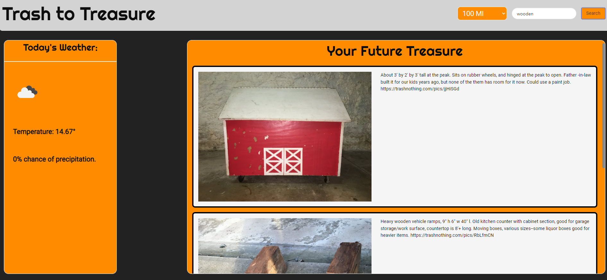

# WARM-Thrifting-Site

We are WARM development and this is our first group project for the OSU coding bootcamp. The site is designed to portray our skills using third party api's, css frameworks, and general website coding. 

Trash to treasure is a site that allows users to search for free or upcycled items in central Ohio. The site also displays the day's current weather allowing users to determine whether or not they want to leave their homes for the item. 

## Screenshot

## Installation

git@github.com:nathanrusselldev/WARM-Trash-to-Treasure.git

## Links

https://nathanrusselldev.github.io/WARM-Trash-to-Treasure/

## Usage

Use to test functionality, critique code, and for general purposes. 

## License

Any images used herein have been licensed under a creative commons license.

Copyright (c) [2022] [NathanRussell]

Permission is hereby granted, free of charge, to any person obtaining a copy
of this software and associated documentation files (the "Software"), to deal
in the Software without restriction, including without limitation the rights
to use, copy, modify, merge, publish, distribute, sublicense, and/or sell
copies of the Software, and to permit persons to whom the Software is
furnished to do so, subject to the following conditions:

The above copyright notice and this permission notice shall be included in all
copies or substantial portions of the Software.

THE SOFTWARE IS PROVIDED "AS IS", WITHOUT WARRANTY OF ANY KIND, EXPRESS OR
IMPLIED, INCLUDING BUT NOT LIMITED TO THE WARRANTIES OF MERCHANTABILITY,
FITNESS FOR A PARTICULAR PURPOSE AND NONINFRINGEMENT. IN NO EVENT SHALL THE
AUTHORS OR COPYRIGHT HOLDERS BE LIABLE FOR ANY CLAIM, DAMAGES OR OTHER
LIABILITY, WHETHER IN AN ACTION OF CONTRACT, TORT OR OTHERWISE, ARISING FROM,
OUT OF OR IN CONNECTION WITH THE SOFTWARE OR THE USE OR OTHER DEALINGS IN THE
SOFTWARE.

